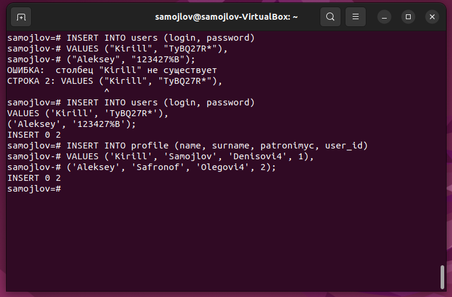
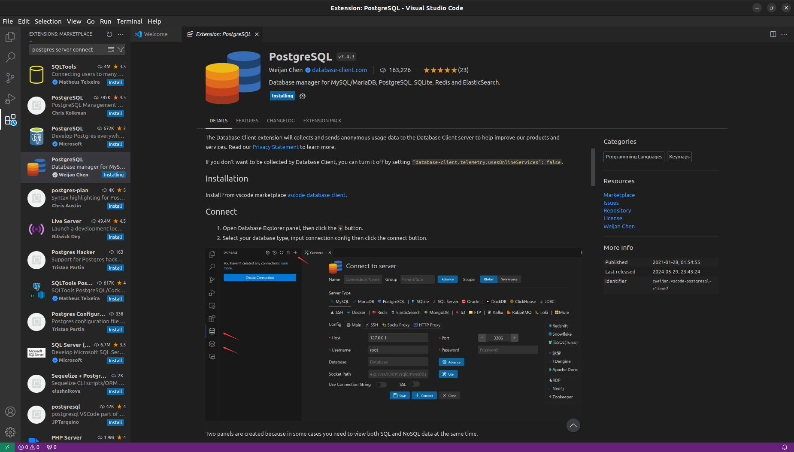
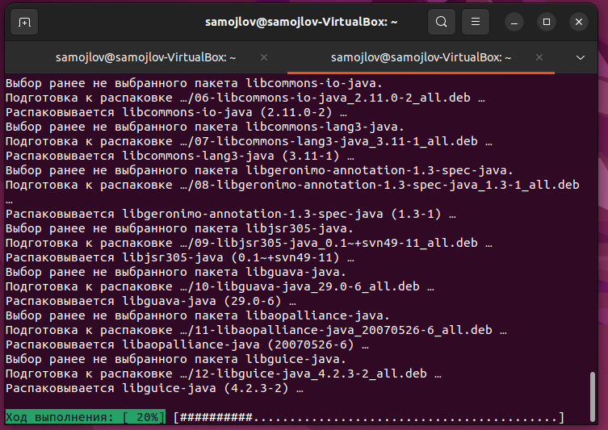

## Развёртка bacend окружения
1. Я установил Ubuntu 22.04 lts на виртуальную машину
 
Рисунок1 - VirtualBox менеджер 
2. Далее в ней я установил java 17 jdk и jre версий
 
Рисунок2 - Начало установки java 17 
 
Рисунок3 - Установка java 17, после подтвердения установки 
 
Рисунок4 - Проверка корректности установки java 17 
3. Затем я Установил Postgresql server через оффициальнный репозитарий
 
Рисунок5 - Установка репозитария 
 
Рисунок6 - Обновление пакетов 
 
Рисунок7 - Установка Postgresql server с этого репозитария 
 
Рисунок8 - 35% установки Postgresql server после потверждения установки 
 
Рисунок9 - Проверка корректности установки Postgresql server 
 
Рисунок10 - Настройка Postgresql server 
4. Я создал базу данных "samojlov" и подключился к ней.
 
Рисунок11 - Создание и подключение к базе данных 
5. Я создал в этой базе данных таблицы users и profile
 
Рисунок12 - Создание таблицы users 
 
Рисунок13 - Создание таблицы profile 
6. Я вставил в них по 2 значения
 
Рисунок14 - Вставка значений 
7. Затем в vs code я подключился к этой же базе данных
 
Рисунок15 - Установка разширения для подключения к postgresql 
 
Рисунок16 - Подключение к базе данных из-под vs code 
8. Затем уже в vs code я создал пару запросов для базы данных
 
Рисунок17 - Запрос 1 
 
Рисунок18 - Запрос 2 
9. Я установил maven в систему
 
Рисунок19 - Начало установки maven 
 
Рисунок20 - Установка maven после подтверждения 
 
Рисунок21 - Проверка корректности установки maven 
10. В vs code я установил разширения для работы с java и maven
 
Рисунок22 - Установка extention пака для работы с java и maven 
11. Я установил разширение spring initializr
 
Рисунок23 - Установка spring initializr 
12. Я создал spring проект с помщью этого разширения
 
Рисунок24 - Контестное меню создания проекта 
 
Рисунок25 - Созданный проект 
13. Я запустил этот проект из-под встроенной консоли в vs code
 
Рисунок26 - Запущенный проект 
